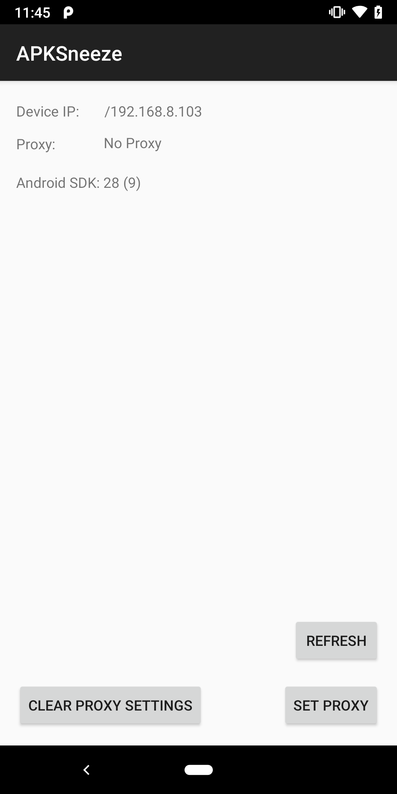
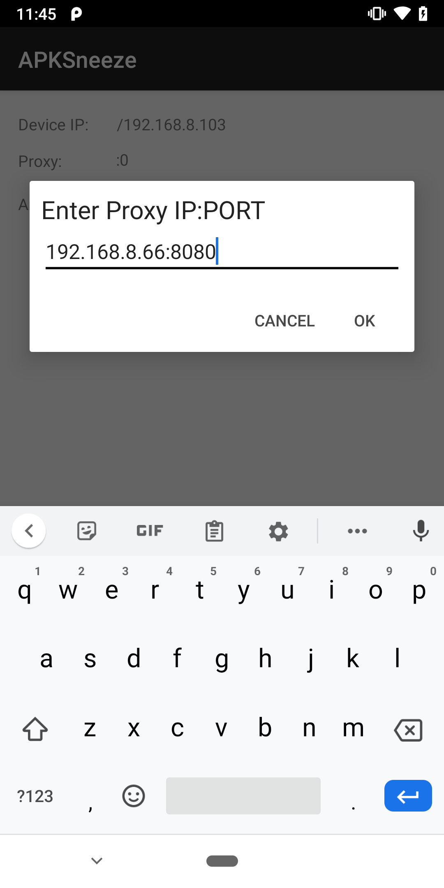
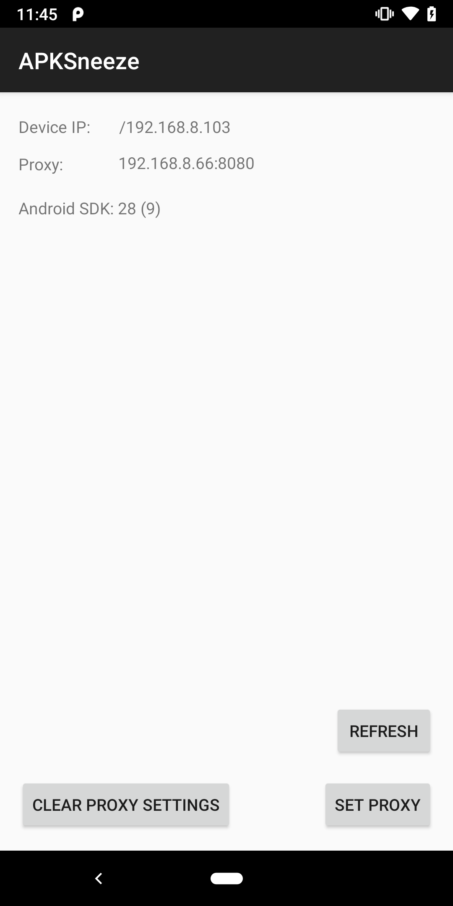

# APKSneeze Mobile
An Android app which eases modifying the mobile device's web proxy settings.

The app tries to solve two issue:
* The lengthy and boring step of setting an android mobile device to use a web proxy. (settings > wifi > advanced etc etc)
* Verifying existing web proxy settings.

This project is a companion to the [APKSneeze](https://github.com/Humoud/apkSneeze) python project, thus the name.

Main Screen:

Modifying Proxy Configuration:

Verifying Proxy Configuration:

## Usage
You can build the project yourself or download the apk from the releases page then install it:

`> adb install apksneeze-mobile.apk`

To give the app access to change the proxy settings, the WRITE_SECURE_SETTINGS permission is required. And it can be granted through ADB like so:

`> adb shell pm grant com.humoud.apksneeze android.permission.WRITE_SECURE_SETTINGS`

